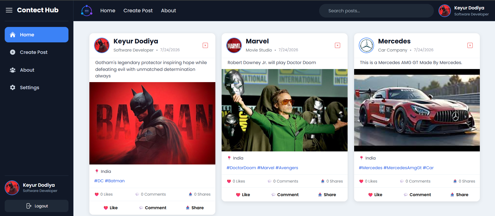
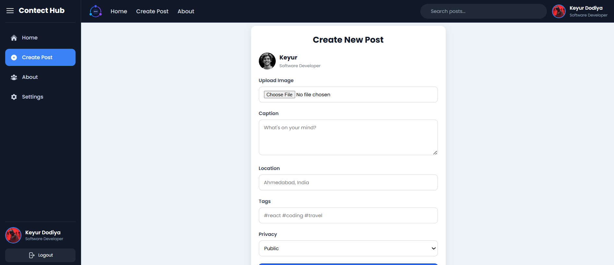
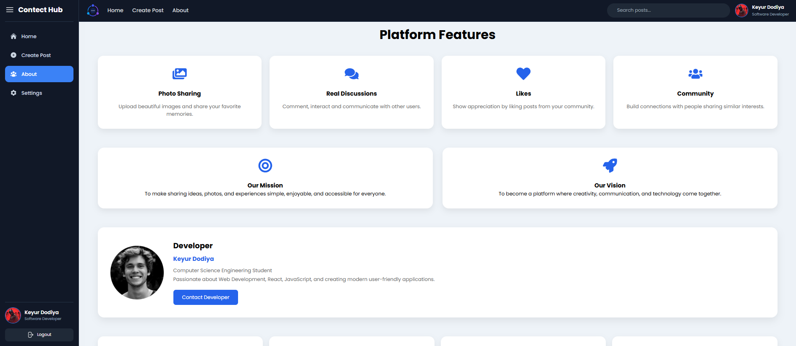

# Content Hub


A modern social media web application built with **React** that allows users to create, explore, and interact with posts in a clean and responsive interface.

------------------------------------------------------------------------
## 📸 Screenshots

### 🏠 Home



The Home page displays all user posts in a clean and responsive feed. Users can like, comment, share, search posts by tags, and delete their own posts.

---

### ➕ Create Post



The Create Post page allows users to upload an image, write a caption, add a location, include tags, and publish a new post instantly.

---

### 👤 About



The About page introduces the Content Hub project, its purpose, technologies used, and developer information in a modern and user-friendly layout.

---

### 🔐 Login


The Login page provides secure user authentication with email and password validation, allowing registered users to access their accounts.

```
------------------------------------------------------------------------

# 📌 Features

-   User Registration and Login
-   Create and Share Posts
-   Upload Images with Posts
-   Like Posts
-   Comment Counter
-   Share Counter
-   Search Posts by Tags
-   Delete Posts
-   Fully Responsive Design
-   Modern and Clean UI
-   Fast React Performance

------------------------------------------------------------------------

# 🛠️ Technologies Used

-   React.js
-   React Router DOM
-   React Context API
-   React Hooks
-   JavaScript (ES6+)
-   HTML5
-   CSS3
-   React Icons
-   Vercel

------------------------------------------------------------------------

# 📂 Project Structure

``` text
Content-Hub/
├── public/
├── src/
│   ├── assets/
│   ├── components/
│   ├── pages/
│   ├── store/
│   ├── App.jsx
│   └── main.jsx
├── package.json
└── README.md
```

------------------------------------------------------------------------

# 🚀 Getting Started

``` bash
git repo : https://github.com/Dodiya-Keyur/Contect-Hub
cd Content-Hub
npm install
npm run dev
```

------------------------------------------------------------------------

# 🎯 Functionalities

-   Authentication
-   Post Creation
-   Image Upload
-   Like, Comment & Share Counters
-   Tag-Based Search
-   Responsive UI

------------------------------------------------------------------------

# 💡 Future Improvements

-   Backend Integration
-   JWT Authentication
-   User Profiles
-   Notifications
-   Dark Mode
-   Real-time Chat
-   Edit & Bookmark Posts

------------------------------------------------------------------------

# 📦 Production

``` bash
npm run build
npm run preview
```

------------------------------------------------------------------------

# 🌐 Deployment

Link : https://contect-hub.vercel.app/

------------------------------------------------------------------------

# 👨‍💻 Author

**Keyur Dodiya**

Computer Science Engineering Student

Building scalable web applications and continuously learning new
technologies.

GitHub : http://github.com/Dodiya-Keyur/

------------------------------------------------------------------------

## ⭐ If you like this project, give it a star on GitHub!
